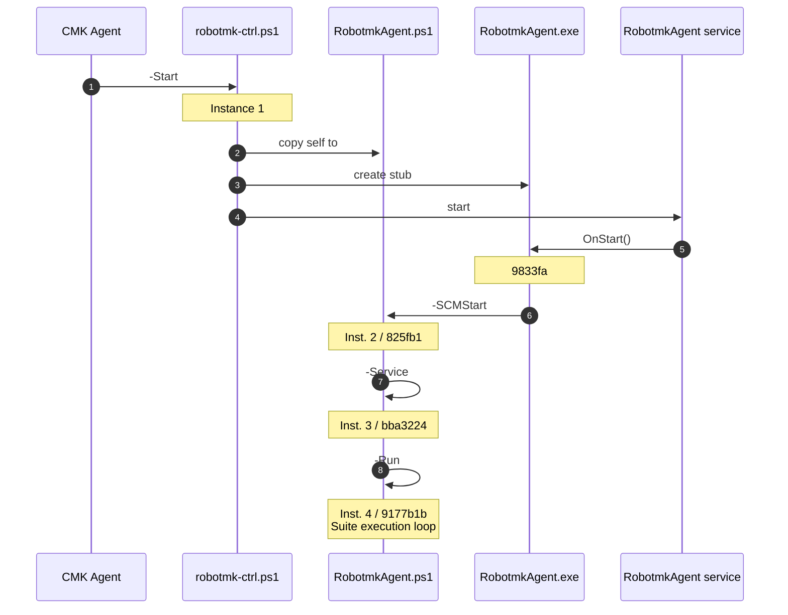

# Development Notes

## Robotmk Controller (Powershell)

Both scripts, `robotmk-ctrl.ps1` and `RobotmkAgent.ps1` should be debugged with Admin privileges, because the first one creates the service and the second one is a service. (-> Open Admin Powershell / Start VS Code with admin privileges)

For development, the env variable `ROBOTMK_common_path__prefix` should be set; it sets the paths of `/config`, `log` and `tmp` below of the `/agent` dir within this project.

`robotmk-ctrl.ps1` is the base script for two types of executions:
- initially called by the CMK Agent as a Plugin (or called by the user). It copies itself to `RobotmkAgent.ps1` outside the Agent dir and installs the Robotmk Windows Service.
- called by the Windows Service Control Manager (SCM) as `RobotmkAgent.ps1`, after it was copied outside of the Agent dir
-
Keep that in mind when Debugging to choose the proper Debugging config.



```
#(ADMIN)
PS> robotmk-ctrl.ps1 -Status
PS> robotmk-ctrl.ps1 -Remove
PS> robotmk-ctrl.ps1 -Install
```


---


## Robotmk agent/specialagent (Python)

### Quickstart

#### Step 0: optional

Install Pyenv to use a separate Python shim than the default one from your OS.

#### Step 1: Install requirements

- pipenv


#### Step 2: Create Python environment

Use `pipenv sync --dev` to create a venv with the dev dependencies.

#### Step 3: install Robotmk editable

After the venv has beend created and entered, install the Robotmk package as *editable*:

```
cd robotmk
# Linux
flit install -s
# Windows (see https://github.com/pypa/flit/issues/325)
flit install --pth-file
```

`robotmk -h` should now be executable.

#### Step 4: configure environment variables

By default, Robotmk assumes the following default configuration:
- Windows:
  - `cfgdir`: `C:/ProgramData/checkmk/agent/config/robotmk` (=> `robotmk.yml`)
  - `logdir`: `C:/ProgramData/checkmk/agent/log/robotmk`
  - `robotdir`: `C:/ProgramData/checkmk/agent/robot`
  - `tmpdir`: `C:/ProgramData/checkmk/agent/tmp/robotmk`
- Linux: (TBD)
  - `cfgdir`: `/etc/check_mk` (=> `robotmk.yml`)
  - `logdir`: `/var/log/robotmk`
  - `robotdir`: `/usr/lib/check_mk_agent/robot`,

`robotmk.yml` is the central configuration file. It can be read from another location and/or certain keys can be overriden by environment variables.

For development, the env variable `ROBOTMK_common_path__prefix` can be set. It defines a common path prefix for the following dirs:

- Windows:
  -  `cfgdir` => `config/robotmk`
  -  `logdir` => `log/robotmk`
  -  `robotdir` => `robot`
  -  `tmpdir` => `tmp`
- Linux:
  -
 `cfgdir`,`logdir`,`tmpdir` and `robotdir`), if they are set *relative*. (Absolute paths are always taken as they are).

For local development you need to set these two environment variables:

```
# set path prefix
export ROBOTMK_common_path__prefix="/home/simonmeggle/Documents/01_dev/rmkv2"
# set relative path to robotmk.yml
export ROBOTMK_common_cfgdir="agent/config/robotmk"
```

See `robotmk/.cli.env` for an example.

Hint: `agent` context of Robotmk requires a YML file to be loaded, where `suite` and `specialagent` can load their configuration completely from environment variables.

#### Step 5: VS Code debugging

`.vscode/launch.json` contains debug configurations for every execution context.

With the environment variables set in step 4, the YML configuration is always loaded from `./robotmk/tests/yml/robotmk.yml`.

### Committing work

[Pre-Commit](https://pre-commit.com) is used to execute hooks before commits can be done to the repo.

The config file `.pre-commit-config.yaml` contains configure hooks for:

- removing trailing whitespace
- fixing EOF
- linting YML
- large file additions
- black formatting


The hooks are executed automatically before every commit, manual execution can be done with:

    pre-commit run --all-files

### Release

`robotmk/release.sh` is used to create new versions of Robotmk on PyPi:

```
./release.sh patch "This is a small patch commit"
./release.sh minor "This is a minor patch commit"
./release.sh major "This is a major patch commit"

```

The following files are updated automatically on each release:

- `src/robotmk/__init__.py` => `__version__` variable
- `../agent/robots/suiteA/conda.yaml` => Robotmk package version to install inside of RCC runs


## Debugging helper

Watch the last lines of the result JSON:
```
watch -n 1 -d "tail ../agent/log/robotmk/results/suite_default*"
```
