# Development Notes

## Robotmk Controller (Windows/Powershell)


### Architecture / sequence diagram

`robotmk-ctrl.ps1` is the base script for two types of executions:
- initially called by the CMK Agent as a Plugin (or called by the user).
- Then `RobotmkScheduler.ps1` in turn is called by the Windows Service Control Manager (SCM)

Its arguments (see top of the script) can be divided into two types:
- arguments which can be used on the command line like `-Install/-Remove/-Status/...` (but not needed for normal users)  and
- arguments which are reserved for the SCM.

In the following, all steps of the sequence diagram below are explained (the refs like `5f8dda` point to the lines in the ps1 script):

1. The Checkmk Agent executes `robotmk-ctrl.ps1` in the normal check interval (1m). When executed without any argument, it runs in monitor mode (`-Monitor`, see ref `bbc7b0e`), which means:
   - Install, Start the Robotmk Service / keep it running
   - produce Agent output
2. Once the controller was started, **it copies itself** to `RobotmkScheduler.ps1` outside the Agent dir into `ProgramData/checkmk/robotmk/`. `RobotmkScheduler.ps1` is the script which will be used by the Windows Service (but not directly, see below). The reason behind creating the copy is that the CMK Agent kills any long-running and hanging plugin scripts when it gets shut down so that the Agent updater (which stops the agent before the update) can overwrite them. The Scheduler script has an own mechanism (deadman switch file) to detect when the Agent was shut down.
3. `5f8dda`: Due to the fact that a Windows service cannot start a script (ps/py) directly, the controller also creates the service stub `RobotmkScheduler.exe`. This is a small executable of a [.NET ServiceBase class ](https://learn.microsoft.com/en-us/archive/msdn-magazine/2016/may/windows-powershell-writing-windows-services-in-powershell#the-net-servicebase-class), which implements the methods the SCM needs to talk to. The C# code can be found within the ps script at ref 5f8dda.
4. `521188`: The controller installs the Scheduler service (if not found). It defines the `RobotmkScheduler.exe` service stub as executable behind the service. The service gets started.
5. `9833fa`: The SCM starts `RobotmkScheduler.exe` and calls its `OnStart()` entrypoint method.
6. `825fb1`: The `Onstart()` method calls `RobotmkScheduler.ps1` with the argument `-SCMStart`; this indicates the script that it was started not manually by the user, but from the Windows Service Control Manager.
7. `bba322`: The `SCM` execution starts another instance of itself with argument `-Service`. In this mode, the script starts the workload loop and listens at the same for control messages from the service stub (e.g. Stop).
8. `9177b1`: Inside of the workload loop (7), the script is started with argument `-Run`. This starts the scheduler main routine.
9. `4b4812`: The Scheduler script uses `rcc` to create the Robotmk Python environment (as defined in `conda.yaml`)
10. `19882f`: start the task `agent-scheduler`, as defined in `robot.yaml`. This is where the Python part begins.
11. Inside of the activated robotmk rcc environment, `rcc` executes the robotmk command `robotmk agent scheduler`.
12. The Robotmk Scheduler (Python) reads from `robotmk.yml` which suites have to be executed and starts them as subprocesses in their individual interval.
13. sdfsd
14. sdf
15. 4873bc

```mermaid
sequenceDiagram
    autonumber
    participant agent as CMK Agent
    participant ctrlps as robotmk-ctrl.ps1
    participant agentps as RobotmkScheduler.ps1
    participant cstub as RobotmkScheduler.exe
    participant service as RobotmkScheduler service
    participant rcc as RCC
    participant robotmk as robotmk (py)
    participant rf as RobotFramework (py)

    agent->>ctrlps:-Monitor (default)
    ctrlps->>+agentps: copy self to
    ctrlps->>cstub: create stub
    ctrlps->>service: create/start
    service->>cstub: OnStart()
    Note over cstub: 9833fa
    cstub->>agentps: -SCMStart
    rect rgb(43, 43, 43)
    Note right of agentps: SCM Execution
    agentps->>agentps: -Service
    rect rgb(60,60,60)
    Note right of agentps: Service execution
    agentps->>agentps: -Run

    rect rgb(70,70,70)

    Note right of agentps: Scheduler execution
    agentps->>rcc: create environments & spaces
    agentps->>rcc: task run -t agent-scheduler
    end %%Run
    end %%Service
    end %%SCMStart
    rcc->>robotmk: robotmk agent scheduler
    rect rgb(43,43,43)
      Note over robotmk: context=agent<br>mode=scheduler
      robotmk->>robotmk: robotmk suite run suite_default
      rect rgb(60,60,60)
        Note over robotmk: suite_default
        robotmk->>rf: robot suite_default
      end %% robotmk suite run suite_default
      robotmk->>robotmk: rcc=YES<br>robotmk suite run suite_rcc
      rect rgb(60,60,60)
        robotmk->>rcc: export suite vars && <br>task run -t robotmk
        rcc->>robotmk: rcc=NO<br>robotmk suite run suite_rcc
        rect rgb(70,70,70)
          Note over robotmk: suite_rcc
          robotmk->>rf: robot suite_rcc
        end
      end %% robotmk suite run suite_rcc


    end %%scheduler
    ctrlps->>rf: sdfd
```




### Reading the logs

The controller/scheduler script are logging into different log files, but have the same format.

`[iso timestamp] [PID] [ARG] [LEVEL] [MESSAGE]`
- PID = of the process logging right now
- ARG = Argument/mode the script was given

```
2023-06-15T12:08:11.407Z [3704]   SCMStop   INFO    RobotmkScheduler.ps1 -SCMStop: Stopping script RobotmkScheduler.ps1 -Service
```

### Debugging

Both scripts, `robotmk-ctrl.ps1` and `RobotmkScheduler.ps1` should be debugged with Admin privileges, because the first one creates the service and the second one is a service. (-> Open Admin Powershell / Start VS Code with admin privileges)

By default the scripts will run with the default agent path of the installed CMK agent.
For development, the env variable `ROBOTMK_common_path__prefix` can be set; it sets the paths of `/config`, `log` and `tmp` below of the `/agent` dir within this project.
This makes development independent from a running CMK agent.

#### Debug the controller

This is how to debug step 2,3 and 4 in the sequence diagram, from the perspective of the CMK Agent:

- (Stop the Checkmk Agent.)
- Copy `robotmk-ctrl.ps1` from `%PROJECT_ROOT%/agent/plugins` to `ProgramData/checkmk/agent/plugins`.
- Start the debugger with `PS CMK robotmk-ctrl.ps1` as Debug configuration
- Logs to watch:
  - in `agent\log\robotmk\robotmk-ctrl.log` you should see:
    - Variable log output
    - copying controller script to Scheduler script (only if the controller script is younger)
    - writing the .env filr for the Scheduler script with all `ROBOMK_` vars known to the controller (will be read by the Scheduler script when started by the service)
    - installing c# service stub (.exe)
    - creating theWindows service
    - starting the service

#### Debug the Scheduler (SCMStart)

WARNING: Do NOT edit the `RobotmkScheduler.ps1` script. The controller will overwrite it at each execution if there were changes.

This is how to debug step 6 in the sequence diagram, from the perspective of the SCM:

  - Start the debugger with `PS RobotmkAgent -SCMStart` as Debug configuration
  - The script will source `RobotmkScheduler.ps1.env` in order to know `ROBOTMK_` variables which were set for the controller
  - in `agent\log\robotmk\RobotmkScheduler.log` you should see:
    - Variable log output
    - Starting itself in Service mode (step 7)

#### Debug the Scheduler (Service)

This is how to debug step 7 in the sequence diagram:

  - Start the debugger with `PS RobotmkAgent -Service` as Debug configuration
  - The script will source `RobotmkScheduler.ps1.env` in order to know `ROBOTMK_` variables which were set for the controller
  - in `agent\log\robotmk\RobotmkScheduler.log` you should see:
    - Variable log output
    - Starting itself doing the workload loop in Run mode (step 8)

#### Debug the Scheduler (Run)

This is how to debug step 8 in the sequence diagram:

- Start the debugger with `PS RobotmkAgent -Run` as Debug configuration
- The script will source `RobotmkScheduler.ps1.env` in order to know `ROBOTMK_` variables which were set for the controller
- in `agent\log\robotmk\RobotmkScheduler.log` you should see:
  - calculation the blueprint hash for conda.yaml
  - check if the blueprint is alread in the RCC catalog (of existing environments)
  - check if there are holotree ("name")spaces for both the output and scheduler mode
  - RCC environment creation
  - start of the RCC task for the Robotmk scheduler, as defined in the `robot.yaml` file:
  ```
  2023-06-15T12:09:15.289Z [9428]   Run       DEBUG   Running Robotmk task 'agent-scheduler' in Holotree space 'robotmk/scheduler'
  2023-06-15T12:09:15.453Z [9428]   Run       DEBUG   !!  C:\Users\vagrant\Documents\01_dev\rmkv2\agent\bin\rcc.exe task run --controller robotmk --space scheduler -t agent-scheduler -r C:\Users\vagrant\Documents\01_dev\rmkv2\agent\config\robotmk\robot.yaml
  ```
  - This is the point where the differences between operating systems end - and where the (OS independent) Python part of Robotmk gets started within an RCC env.
  As a consequence, there is nothing more to debug here. To get into the execution of the RCC task, read next section.

#### Debug the RCC task

This section

        - Copy the command which was logged to execute the RCC task "agent-scheduler"
        - Open a Admin-CMD and execute the command here. (It should fail as well.)
        - To get a shell inside of the RCC environment, you have to change the command from a task execution to task shell:
        `C:\Users\vagrant\Documents\01_dev\rmkv2\agent\bin\rcc.exe task shell -r C:\Users\vagrant\Documents\01_dev\rmkv2\agent\config\robotmk\robot.yaml `
        - Inside of that shell, the python interpreter of the Robotmk RCC environment is set. Here you can list pip packages, execute the `robotmk` CLI etc.


### Debugging


```
#(ADMIN)
PS> robotmk-ctrl.ps1 -Install  # install the service
PS> robotmk-ctrl.ps1 -Status   # show the service's status
PS> robotmk-ctrl.ps1 -Remove   # uninstall the service

```


---


## Robotmk agent/specialagent (Python)

### Quickstart

#### Step 0: optional

Install Pyenv to use a separate Python shim than the default one from your OS.

#### Step 1: Install requirements

- pipenv


#### Step 2: Create Python environment

Use `pipenv sync --dev` to create a venv with the dev dependencies.

#### Step 3: install Robotmk editable

After the venv has beend created and entered, install the Robotmk package as *editable*:

```
cd robotmk
# Linux
flit install -s
# Windows (see https://github.com/pypa/flit/issues/325)
flit install --pth-file
```

`robotmk -h` should now be executable.

#### Step 4: configure environment variables

By default, Robotmk assumes the following default configuration:
- Windows:
  - `cfgdir`: `C:/ProgramData/checkmk/agent/config/robotmk` (=> `robotmk.yml`)
  - `logdir`: `C:/ProgramData/checkmk/agent/log/robotmk`
  - `robotdir`: `C:/ProgramData/checkmk/agent/robots`
  - `tmpdir`: `C:/ProgramData/checkmk/agent/tmp/robotmk`
- Linux: (TBD)
  - `cfgdir`: `/etc/check_mk` (=> `robotmk.yml`)
  - `logdir`: `/var/log/robotmk`
  - `robotdir`: `/usr/lib/check_mk_agent/robots`,

`robotmk.yml` is the central configuration file. It can be read from another location and/or certain keys can be overriden by environment variables.

For development, the env variable `ROBOTMK_common_path__prefix` can be set. It defines a common path prefix for the following dirs:

- Windows:
  -  `cfgdir` => `config/robotmk`
  -  `logdir` => `log/robotmk`
  -  `robotdir` => `robots`
  -  `tmpdir` => `tmp`
- Linux:
  -
 `cfgdir`,`logdir`,`tmpdir` and `robotdir`), if they are set *relative*. (Absolute paths are always taken as they are).

For local development you need to set this environment variable:

```
# path prefix
export ROBOTMK_common_path__prefix="/home/simonmeggle/Documents/01_dev/rmkv2/agent"
```

See `robotmk/.cli.env` for an example.

Hint: `agent` context of Robotmk requires a YML file to be loaded, where `suite` and `specialagent` can load their configuration completely from environment variables.

#### Step 5: VS Code debugging

`.vscode/launch.json` contains debug configurations for every execution context.

With the environment variables set in step 4, the YML configuration is always loaded from `./robotmk/tests/yml/robotmk.yml`.

#### Step 6: Open tmuxp session

The pipenv dev dependencies also contains `tmuxp` which opens a multipane view.

To start a tmuxp session, you have to execute the following command from the project's root dir:

    tmuxp load contrib/tmuxp.yaml


### Committing work

[Pre-Commit](https://pre-commit.com) is used to execute hooks before commits can be done to the repo.

The config file `.pre-commit-config.yaml` contains configure hooks for:

- removing trailing whitespace
- fixing EOF
- linting YML
- large file additions
- black formatting


The hooks are executed automatically before every commit, manual execution can be done with:

    pre-commit run --all-files

### Release

`robotmk/release.sh` is used to create new versions of Robotmk on PyPi:

```
./release.sh patch "This is a small patch commit"
./release.sh minor "This is a minor patch commit"
./release.sh major "This is a major patch commit"

```

The following files are updated automatically on each release:

- `src/robotmk/__init__.py` => `__version__` variable
- `../agent/robots/suiteA/conda.yaml` => Robotmk package version to install inside of RCC runs


## Debugging helper

Watch the last lines of the result JSON:
```
watch -n 1 -d "tail ../agent/log/robotmk/results/suite_default*"
```
