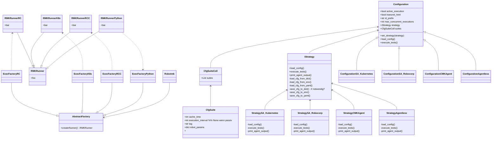

```mermaid
classDiagram

Robotmk --> AbstractFactory

class Robotmk {
    
}

class RMKRunner {
    +foo
}

RMKRunnerPython ..> ExecFactoryPython
RMKRunnerPython --|> RMKRunner
class RMKRunnerPython {
    +bar
}
RMKRunnerRCC <.. ExecFactoryRCC
RMKRunnerRCC --|> RMKRunner
class RMKRunnerRCC {
    +bar
}
RMKRunnerK8s <.. ExecFactoryK8s
RMKRunnerK8s --|> RMKRunner
class RMKRunnerK8s {
    +bar
}

RMKRunnerRC <.. ExecFactoryRC
RMKRunnerRC --|> RMKRunner
class RMKRunnerRC {
    +bar
}

class AbstractFactory {
    +createRunner()* RMKRunner


}

ExecFactoryPython --|> AbstractFactory
class ExecFactoryPython {
    
}

ExecFactoryRCC --|> AbstractFactory
class ExecFactoryRCC {
    
}
ExecFactoryK8s --|> AbstractFactory
class ExecFactoryK8s {
    
}
ExecFactoryRC --|> AbstractFactory
class ExecFactoryRC {
    
}

%%-----

Configuration <-- CfgSuiteColl

CfgSuiteColl <-- CfgSuite

IStrategy <-- StrategySA_Kubernetes

IStrategy <-- StrategySA_Robocorp

IStrategy <-- StrategyCMKAgent

%% There is no Agent & no YML => Docker container

IStrategy <-- StrategyAgentless

Configuration <-- IStrategy

  

class Configuration{

+bool active_execution

+bool transmit_html

+str id_prefix

+int max_concurrent_executions

+IStrategy strategy

+CfgSuiteColl suites

+set_strategy(strategy)

+load_config()

+execute_tests()

}

Configuration <|-- ConfigurationSA_Kubernetes

Configuration <|-- ConfigurationSA_Robocorp

Configuration <|-- ConfigurationCMKAgent

Configuration <|-- ConfigurationAgentless

  

class ConfigurationSA_Kubernetes{

  

}

  

class CfgSuiteColl{

+List suites

}

  

class CfgSuite{

+int cache_time

+int execution_interval %% None wenn passiv

+str tag

+dict robot_params

+

}

  

class IStrategy{

+load_config()

+execute_tests()

+print_agent_output()

-load_cfg_from_dict()

-load_cfg_from_env()

-load_cfg_from_yaml()

-save_cfg_to_dict() # notwendig?

-save_cfg_to_env()

-save_cfg_to_yaml()

}

class StrategySA_Kubernetes{

-load_config()

-execute_tests()

-print_agent_output()

}

class StrategySA_Robocorp{

-load_config()

-execute_tests()

-print_agent_output()

}

class StrategyCMKAgent{

-load_config()

-execute_tests()

-print_agent_output()

}

c

class StrategyAgentless{

-load_config()

-execute_tests()

-print_agent_output()

}

```

